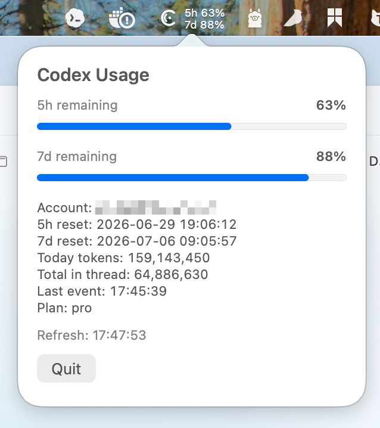

# Codex Usage Menubar

A tiny native macOS menu bar monitor for Codex usage limits and token activity.

It shows the current Codex 5-hour and 7-day remaining usage directly in the
macOS menu bar, with a click-through detail panel for account, reset times, and
today's local token activity.



## Download

Download the latest `.dmg` from GitHub Releases:

https://github.com/jiangjianzeng/codex-usage-menubar/releases/latest

Open the DMG, drag `Codex Usage Menubar.app` to `Applications`, then launch it.

## Why This Exists

Codex Usage Menubar gives the OAuth account usage window a lightweight
always-visible monitor, similar to a network speed indicator. Local session logs
are used only for token activity details.

## Performance First

- Native AppKit + Swift.
- No Electron, no web view, no Node runtime.
- No third-party dependencies.
- PNG-sourced macOS app icon generated at build time.
- Streams Codex JSONL logs line by line.
- Refreshes in the background every 120 seconds.
- Direct release binary is about 300 KB on Apple Silicon.

## What It Shows

- Status bar, two compact lines:
  - `5h` remaining percentage from Codex OAuth usage status
  - `7d` remaining percentage from Codex OAuth usage status
- Click popover:
  - account label from `~/.codex/auth.json` (`email` from ID token when available, otherwise `account_id`)
  - 5h reset time and 7d reset date/time
  - today token total from local `token_count` deltas
  - latest thread total tokens
  - plan type and refresh status

## Data Source

The 5-hour and 7-day usage windows come from the Codex OAuth account backend
used by the Codex client. If that request is unavailable, the menu bar displays
`--%` instead of falling back to stale local rate-limit fields.

For token activity details, this app reads Codex session JSONL files under:

- `~/.codex/sessions`
- `~/.codex/archived_sessions`

It only parses `token_count` events and ignores prompt/message content. Local
JSONL data is not used for the 5-hour or 7-day remaining percentages.

## Build And Run

This repo includes a direct `swift-frontend` build script for a small signed
Apple Silicon app bundle and binary:

```bash
bash scripts/build-app.sh
open .build/release/CodexUsageBar.app
```

Build a local installer DMG:

```bash
bash scripts/package-dmg.sh
```

If SwiftPM works on your machine, the package is also laid out for:

```bash
swift test
swift build -c release
```

## Run As A LaunchAgent

For a persistent menu bar process during development:

```bash
LABEL="local.codex-usage-bar.dev"
DOMAIN="gui/$(id -u)"
PLIST="/tmp/${LABEL}.plist"
APP_BIN="$(pwd)/.build/release/CodexUsageBar"

cat > "$PLIST" <<PLIST
<?xml version="1.0" encoding="UTF-8"?>
<!DOCTYPE plist PUBLIC "-//Apple//DTD PLIST 1.0//EN" "http://www.apple.com/DTDs/PropertyList-1.0.dtd">
<plist version="1.0">
<dict>
  <key>Label</key>
  <string>${LABEL}</string>
  <key>ProgramArguments</key>
  <array><string>${APP_BIN}</string></array>
  <key>RunAtLoad</key><true/>
</dict>
</plist>
PLIST

launchctl bootstrap "$DOMAIN" "$PLIST"
```

Stop it with:

```bash
launchctl bootout "gui/$(id -u)/local.codex-usage-bar.dev"
```

## Performance Notes

- AppKit-only, no Electron/Tauri/web runtime.
- No third-party dependencies.
- Refreshes every 120 seconds.
- Streams JSONL line by line instead of loading session files into memory.

## License

MIT
